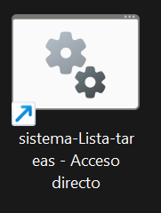
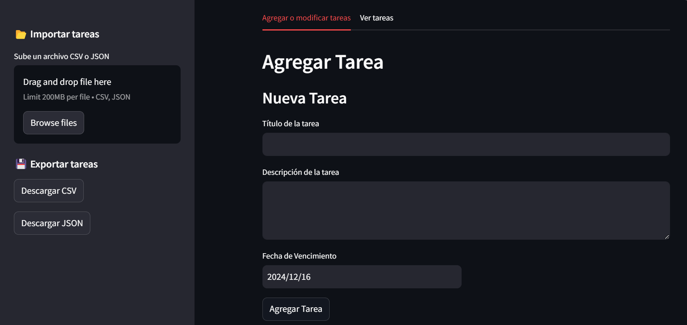
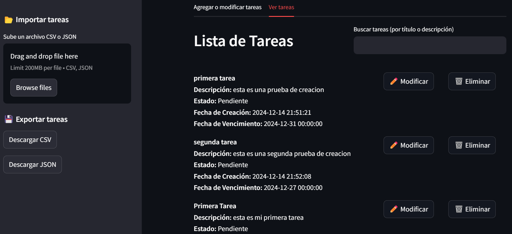
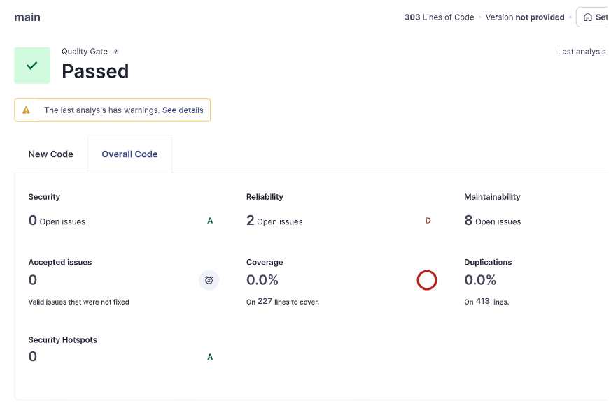

# **Sistema de Lista de Tareas**

## **Herramientas Necesarias**

### **Requisitos**
- **Python**
- **MySQL** (opcional)

### **Instalaciones Requeridas en Python**
- **Entorno virtual**
- **Streamlit**
- **SQLAlchemy**

---

## **Configuraciones**

### **Configuración de la Aplicación**
En el proyecto, hay un archivo llamado **`sistema-Lista-tareas.bat`**.
1. En la segunda línea de ese archivo, debes cambiar la ubicación para que apunte al directorio actual donde se encuentra el archivo.

### **Configuración de la Conexión a la Base de Datos (MySQL, opcional)**
1. En la carpeta **`data`**, hay un archivo llamado **`conexion.py`**.
2. Cambia las líneas de configuración con los datos correspondientes a tu base de datos MySQL (usuario, contraseña, host, puerto, nombre de la base de datos, etc.).
3. Si no deseas usar MySQL, no necesitas realizar esta configuración.
4. Para habilitar MySQL en la aplicación, modifica el archivo **`app.py`**.
   - Cambia la línea 3 que dice:
     ```python
     import data.crudLite
     ```
     por:
     ```python
     import data.crud
     ```
   
Esto es todo lo necesario para configurar la base de datos MySQL.

---

## **Modo de Uso**

### **Iniciación del Sistema**
1. Después de realizar la configuración de la aplicación, se recomienda crear un acceso directo del archivo **`sistema-Lista-tareas.bat`**.
2. Mueve el acceso directo al escritorio para facilitar su uso.

**Ejemplo de acceso directo:**



---

## **Funcionalidades**

El sistema de lista de tareas cuenta con las siguientes funcionalidades clave:

- **Importar y Exportar Tareas**: Posibilidad de cargar y guardar listas de tareas.
- **Registrar Tareas**: Crear nuevas tareas con título, descripción y fecha de vencimiento.
- **Modificar Tareas**: Editar las tareas existentes.
- **Eliminar Tareas**: Eliminar tareas de forma rápida y sencilla.
- **Búsqueda de Tareas**: Buscar tareas específicas por título o descripción.

El sistema cuenta con una interfaz intuitiva y fácil de usar para gestionar las tareas.

**Vista previa de la interfaz:**





---

## **Análisis de Calidad del Proyecto**

A continuación, se muestra el análisis de la calidad del código realizado mediante **SonarQube**. Este análisis permite identificar errores de código, problemas de seguridad y otros aspectos importantes de la calidad del software.

**Informe de análisis de SonarQube:**



---

Con esta guía, ya tienes toda la información necesaria para instalar, configurar y usar el **Sistema de Lista de Tareas** de forma eficiente.

